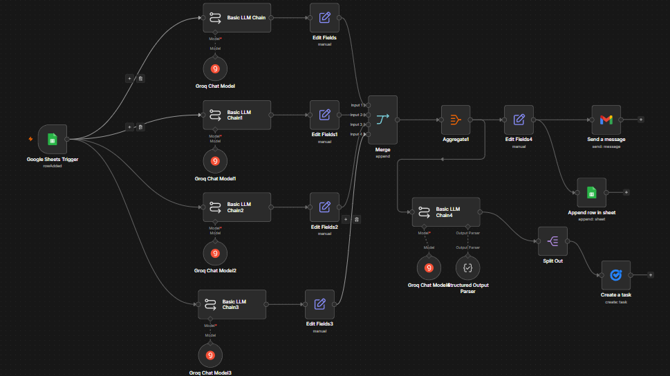
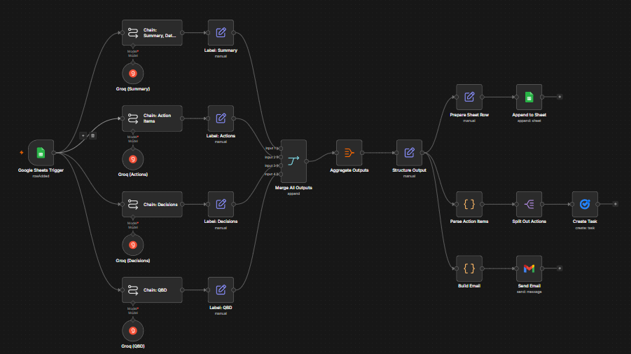
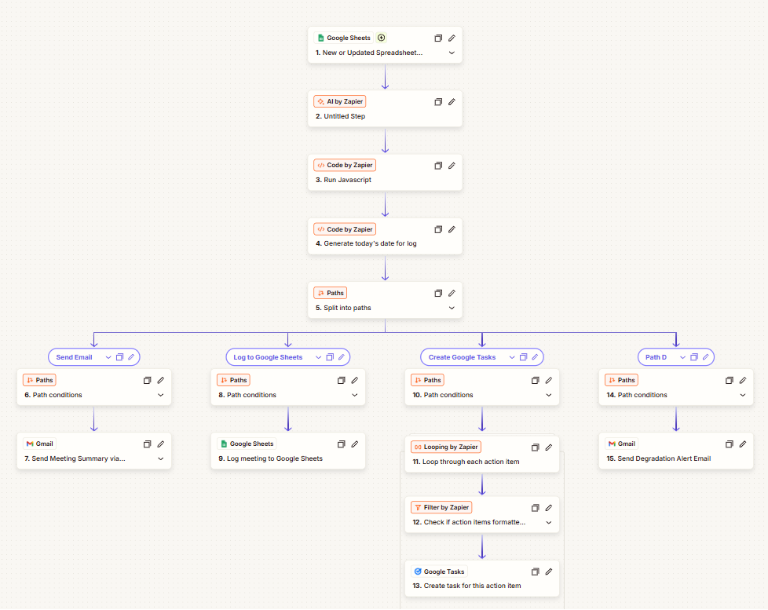

# P01 — Meeting Intelligence Pipeline

An automation that turns a raw meeting transcript into a structured debrief: summary, action items, decisions, and open questions, routed to Gmail, Google Sheets, and Google Tasks in a single run. Paste a transcript in, get a complete meeting record out.

This is the pipeline I keep rebuilding on purpose. It exists in three builds across two platforms, because measuring the same spec against different build tools is the experiment.

**Manual n8n build:**

**Claude Code build (same spec):**

**Zapier Copilot build (platform-native redesign):**

---

## The Builds

| Folder | Platform | Build tool | The point |
|---|---|---|---|
| [`n8n-manual-build/`](n8n-manual-build/) | n8n | By hand | The reference build: 4 parallel LLM chains, full architecture README |
| [`claude-code-build/`](claude-code-build/) | n8n | Claude Code | Same spec, 4x faster build, zero logic debugging |
| [`zapier-copilot-build/`](zapier-copilot-build/) | Zapier | Zapier Copilot | Same goal on the competing platform: 1 AI call, 4-way Paths fan-out, three-layer failure isolation |
| [`zapier-eval-build/`](zapier-eval-build/) | Zapier | In progress | Eval harness: 7 ground-truth transcripts, extraction rules, LLM-judge scoring spec |

## The n8n Benchmark (manual vs. Claude Code)

I built the pipeline manually first (about 8 hours, including 6 distinct logic bugs I had to chase down). Then I rebuilt the same spec with Claude Code.

| Metric | Manual n8n Build | Claude Code Build |
|--------|-----------------|-------------------|
| Runtime | 8.385 seconds | 9.316 seconds |
| Tokens per run | 3,762 | 3,194 |
| Build time | ~8 hours | ~2 hours |
| Logic debugging required | Yes (6 distinct issues) | None |

Equivalent pipeline performance at 4x the build speed. What Claude Code got right automatically were the exact pain points I had to work through by hand.

## The Zapier Comparison

The Zapier build is not a port; it is a platform-native redesign. n8n runs four LLM chains in parallel and merges; Zapier runs one extraction call and fans out through Paths. The Zapier version adds what the n8n builds lack: failure isolation (validate-and-substitute, a loop guard, and a degradation alert email that suppresses the recap when an AI field comes back empty). The full tradeoff table is in [`zapier-copilot-build/README.md`](zapier-copilot-build/README.md).

The [`zapier-eval-build/`](zapier-eval-build/) folder is the next step: seven synthetic transcripts with ground truth (clean standup, messy quarterly planning, no-decision discovery, diacritic names, ambiguous due dates, side-conversation filtering) and the scoring rules for an LLM judge, so pipeline changes get caught by regression scores instead of vibes.
