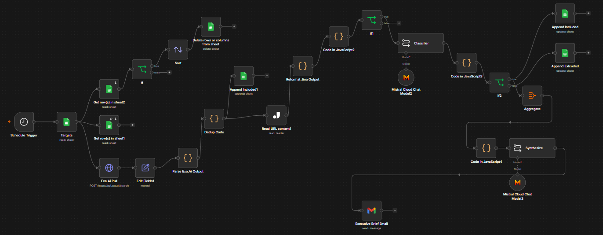
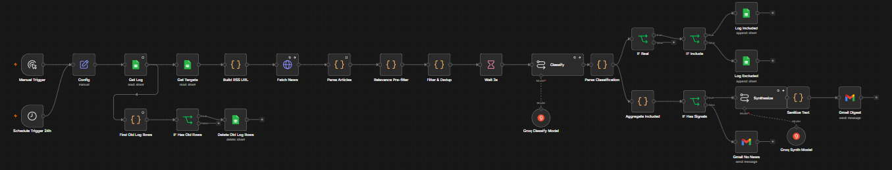

# P02: AI Competitive Intelligence Monitor

An n8n workflow that watches 10 AI companies daily, filters and classifies the news, and emails a synthesized executive briefing every morning. Every signal is logged to a persistent Google Sheets record with cross-run deduplication, so the same article never gets reported twice.

There are two builds of this monitor, and they made different sourcing choices.

**Manual build (Exa.ai + Jina):**

**Claude Code build (Google News RSS + Groq):**

---

## The Two Builds

| | Manual Build | Claude Code Build |
|---|---|---|
| News source | Exa.ai semantic search | Google News RSS (free, no key) |
| Enrichment | Jina article extraction | None needed (RSS descriptions) |
| Classification | LLM signal typing | Groq `llama-3.1-8b-instant` |
| Synthesis | LLM daily briefing | Groq `llama-3.3-70b-versatile` |

The manual build came first and proved the concept with paid-tier semantic search. The Claude Code rebuild was constrained to free APIs and solved the same problem with RSS plus heavier filtering: a relevance pre-filter, an 8-category classifier, a $100M funding threshold rule, and a sentinel pattern that guarantees one email per run even when no news survives the funnel.

---

## Folders

| Folder | Contents |
|---|---|
| [`n8n-manual-build/`](n8n-manual-build/) | The Exa.ai + Jina workflow JSON |
| [`claude-code-build/`](claude-code-build/) | The RSS + Groq rebuild, with the full architecture doc in its `CLAUDE.md` |
| [`snowflake-build/`](snowflake-build/) | The data layer rebuilt on Snowflake: a raw landing zone, a SQL transform that dedups into a modeled fact table, and classification run in-warehouse with Cortex. Spec plus runnable `setup.sql` |

The Claude Code build's [`CLAUDE.md`](claude-code-build/CLAUDE.md) documents the architectural decisions: rate-limit mitigation, cross-run dedup keyed on URL, 7-day log retention, and why intra-run duplicates are intentionally kept.
