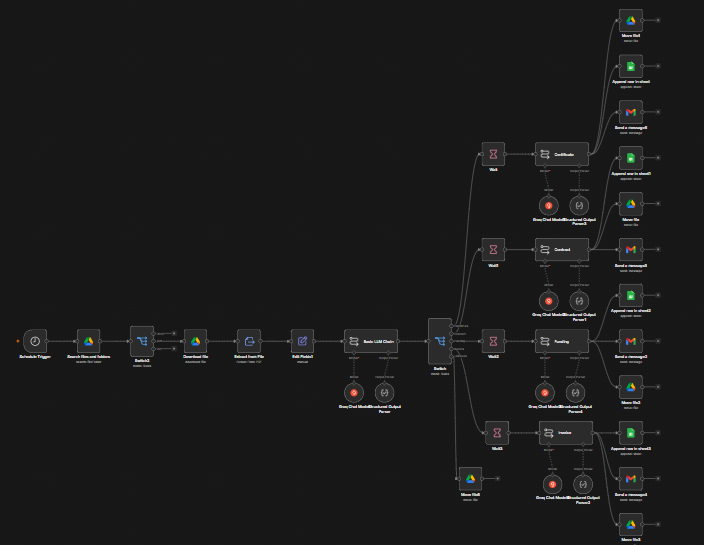

# n8n Document Processing & Classification Workflow


An automated document classification and routing pipeline built in n8n. Drop a PDF into a Google Drive inbox folder. The workflow reads it, classifies it using AI, extracts structured metadata, routes it to the correct subfolder, logs everything to Google Sheets, and sends a formatted email summary. Zero manual sorting required.



---

## What It Does

When a new PDF lands in the watched Google Drive inbox folder, the workflow:

1. Downloads and extracts the document text
2. Classifies the document into one of four categories using an LLM
3. Routes high-confidence documents to the correct Google Drive subfolder
4. Flags ambiguous or hybrid documents to a Review folder for human review
5. Extracts category-specific metadata fields using a second targeted LLM call
6. Logs all metadata to Google Sheets
7. Sends a clean formatted HTML email summary with the extracted details
8. Moves the file from the source folder to the correct categorized folder

---

## Document Categories

| Category | What It Classifies | (note, synthetic files were used for this workflow)
|---|---|
| **Funding Doc** | Investment agreements, term sheets, seed/series rounds |
| **Contract** | Service agreements, vendor MSAs, legal contracts (services only, no investment component) |
| **Invoice** | Vendor bills, payment requests, subscription renewals |
| **Certificate** | Training credentials, professional certifications, course completions |
| **Unknown** | Hybrid documents or anything that doesn't clearly fit one category; routed to Review folder |


---

## Google Drive Folder Structure

```
Doc Processing Pipeline/
├── Inbox/                    ← Drop files here
├── Classified/
│   ├── Funding_Docs/
│   ├── Contracts/
│   ├── Invoices/
│   └── Certs/
├── Review/                   ← Unknown/ambiguous documents
└── Staging/                  ← Google Sheet lives here
```

---

## Google Sheets Logging

One spreadsheet with four tabs for each document type. Each row is one processed document.

**Funding Docs:** Timestamp | Filename | File ID | Funder | Recipient | Amount | Program | Key Terms 

**Contracts:** Timestamp | Filename | File ID | Vendor | Customer | Effective Date | Expiration Date | Contract Value | Key Services | Governing Law 

**Invoices:** Timestamp | Filename | File ID | Vendor | Customer | Invoice # | Invoice Date | Due Date | Amount | Line Items | Payment Status

**Certs:** Timestamp | Filename | File ID | Cert Holder | Issuer | Cert Type | Issue Date | Expiration Date | Cert # 

---


## Prerequisites

- n8n Cloud account (or self-hosted n8n instance)
- Google account with Drive, Sheets, and Gmail access
- Groq API key (free tier available)

---

## Setup

### Step 1: Google Drive
Create the folder structure above. Copy the folder ID from the URL of each folder; you'll need them in n8n.

```
https://drive.google.com/drive/folders/[FOLDER_ID_IS_HERE]
```

### Step 2: Google Sheets
Create a spreadsheet with four tabs named exactly:
- `Certs`
- `Contracts`
- `Funding Doc`
- `Invoices`

Add the column headers for each tab as listed in the Google Sheets Logging section above.

### Step 3: n8n Credentials
Create the following credentials in n8n:

| Credential | Used By |
|---|---|
| Groq API | All LLM nodes |
| Google Drive OAuth2 | Search, Download, Move nodes |
| Google Sheets OAuth2 | Append row nodes |
| Gmail OAuth2 | Send email nodes |

### Step 4: Import Workflow
1. Import `P03-document-processing.json` via the n8n workflow menu (⋯ → Import)
2. Update all Google Drive nodes with your actual folder IDs
3. Update all Google Sheets nodes with your spreadsheet ID and tab names
4. Update the Gmail node with your email address
5. Connect all credentials to their respective nodes
6. Activate the workflow

### Step 5: Test
Upload a PDF to your Inbox folder. Within 60 seconds you should see:
- The file moved to the correct subfolder
- A new row in the appropriate Google Sheet tab
- A formatted HTML email in your inbox

---

## Environment Variables

Set these in your n8n instance settings or as environment variables:

```
GROQ_API_KEY=
INBOX_FOLDER_ID=
FUNDING_FOLDER_ID=
CONTRACTS_FOLDER_ID=
INVOICES_FOLDER_ID=
CERTS_FOLDER_ID=
REVIEW_FOLDER_ID=
GOOGLE_SHEETS_ID=
```

---


## File Structure

```
P03-document-processing/
├── P03-document-processing.json    ← n8n workflow (credentials scrubbed)
├── README.md                       ← Setup and human-facing instructions
├── REQUIREMENTS.md                 ← Functional and non-functional requirements
└── BUILD_PROCESS.md                ← Architecture, design decisions, lessons learned
```

---

## Built With

- [n8n](https://n8n.io); workflow automation
- [Groq](https://console.groq.com); LLM inference
- [LLaMA 3.1 8b Instant](https://groq.com); document classification
- [LLaMA 3.3 70b Versatile](https://groq.com); metadata extraction
- Google Drive; document storage and routing
- Google Sheets; persistent classification log
- Gmail; formatted email notifications

---

## Part of a Larger Portfolio

This workflow is the third in a series of n8n automation projects I built to work through real design problems: parallel branching, identifier threading, model tiering, and structured output.

| # | Project | Status |
|---|---|---|
| 1 | Meeting Intelligence Pipeline | ✅ Complete |
| 2 | Competitive Intelligence Monitor | ✅ Complete |
| 3 | Document Processing & Routing | ✅ Complete |
| 4 | AI Governance & Audit Trail | ✅ Complete |
| 5 | Employee Onboarding Orchestrator | ✅ Complete |
| 6 | Lead Generation & Enrichment | ✅ Complete |
| 7 | Customer Trigger Messaging | ✅ Complete |
