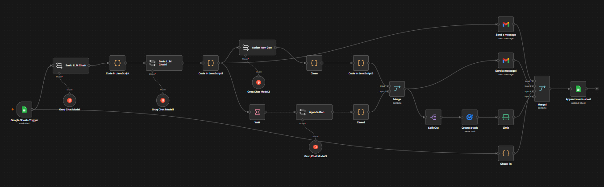
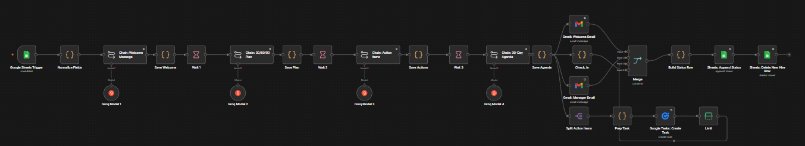

# P05 — Employee Onboarding Orchestrator

An n8n workflow that runs the full new-hire onboarding sequence from a single trigger. Add a row to a Google Sheet and the workflow generates a personalized welcome email and a 30-60-90 day plan for the new hire, action items and a first-week agenda for the manager, one Google Task per action item, a calculated 30-day check-in date, and a status log entry. All generation runs on Groq (`llama-3.3-70b-versatile`), personalized per hire.

**Manual n8n build:**

**Claude Code build (same spec):**

---

## Folders

| Folder | Contents |
|---|---|
| [`n8n-manual-build/`](n8n-manual-build/) | The hand-built workflow JSON and the full README: architecture, node table, design decisions, and setup |
| [`claude-code-build/`](claude-code-build/) | The Claude Code rebuild of the same spec |

Full detail is in [`n8n-manual-build/README.md`](n8n-manual-build/README.md). The design decisions section is the interesting part: treating LLM output as dirty by default, using `---` delimiters instead of newlines for reliable list splitting, and a Limit node as a synchronization trick before the final log write.
