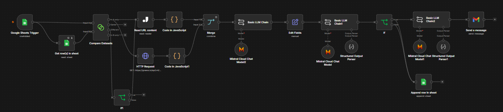
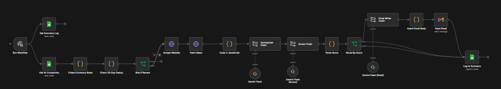
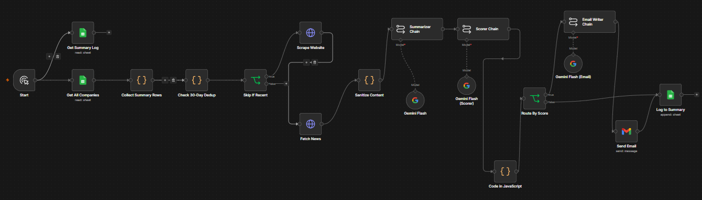

# P06 — Lead Generation and Enrichment Pipeline

An n8n workflow that takes a Google Sheet of target companies and automates the research, scoring, and outreach. For each new company it scrapes the website via Jina Reader, pulls recent news, summarizes with an LLM, scores fit 1 to 10 against a defined persona, and sends a personalized outreach email only when the score clears a threshold. Everything is logged, and a 30-day dedup window keeps recently contacted companies from being reprocessed.

This is the project I used to run a three-way build comparison: manual n8n, Claude Code, and OpenCode building the same spec.

All three builds of the same spec, on the canvas:

**Manual n8n build:**

**Claude Code build (R2):**

**OpenCode build:**

---

## The Three-Way Comparison

| Build | Tool | Result |
|---|---|---|
| [`n8n-manual-build/`](n8n-manual-build/) | Hand-built in n8n | Baseline |
| [`claude-code-r2/`](claude-code-r2/) | Claude Code from a written spec | 2.4x faster build than manual |
| [`opencode-build/`](opencode-build/) | OpenCode (VS Code extension, OpenRouter) | Generated the JSON; required post-import debugging and rewiring |

Same requirements document, three build tools, measured results. The point was never to crown a winner. It was to learn what each tool gets right on its own and where the human work actually goes.

---

## Key Files

| File | Contents |
|---|---|
| [`claude-code-r2/P6_Requirements.md`](claude-code-r2/P6_Requirements.md) | The requirements document all three builds were built against: scope, functional and non-functional requirements, acceptance criteria |
| [`claude-code-r2/BUILD_PROCESS.md`](claude-code-r2/BUILD_PROCESS.md) | The build spec: architecture, node tables, technology choices, scoring prompt, JSON output rules |
| [`claude-code-r2/CLAUDE.md`](claude-code-r2/CLAUDE.md) | Build rules for Claude Code: what to build, constraints, phase gates, pointers to the two docs above |
