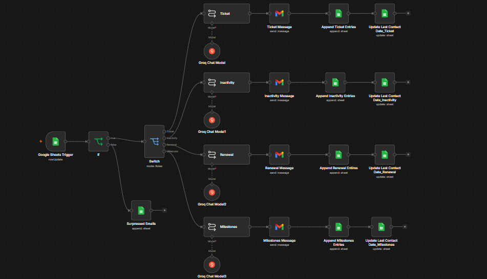
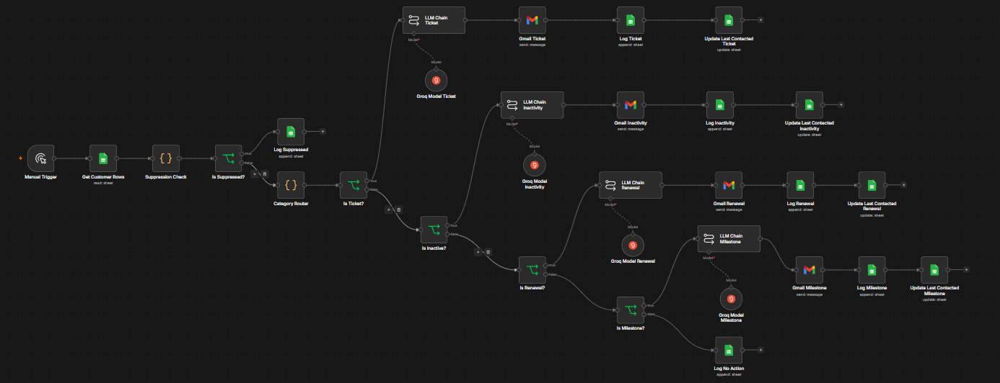

# P07: Customer Trigger Messaging Pipeline

An n8n workflow that watches a customer database and sends personalized, AI-generated outreach when one of four behavioral triggers fires: a support ticket closed in the last 24 hours, 14+ days of inactivity, a renewal within 30 days, or a milestone reached. Each trigger type gets its own prompt and its own email. A 7-day cooldown suppresses repeat contact, and every send (or suppression) is written to an append-only activity log.

**Manual n8n build:**

**Claude Code build (same spec):**

---

## Folders

| Folder | Contents |
|---|---|
| [`n8n-manual-build/`](n8n-manual-build/) | The hand-built workflow JSON and the full README: routing logic, prompts per trigger type, sheet schemas |
| [`claude-code-build/`](claude-code-build/) | The Claude Code rebuild, with build notes in `LESSONS_LEARNED.md` |
| [`snowflake-build/`](snowflake-build/) | The data layer rebuilt on Snowflake: a customer dimension, an append-only activity fact, and a SQL view that does the 7-day suppression and the priority cascade. Spec plus runnable `setup.sql` |

Full detail is in [`n8n-manual-build/README.md`](n8n-manual-build/README.md). The design choice that matters most: suppression is policy logic in an IF node, not an LLM decision, so a model can never talk the pipeline into over-contacting a customer.
